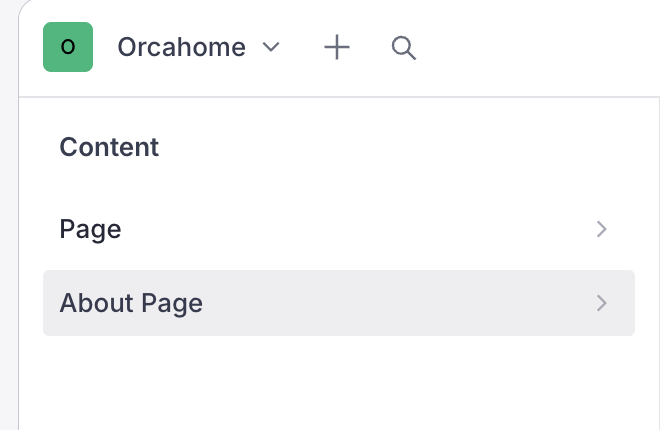
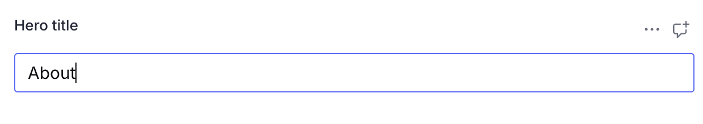
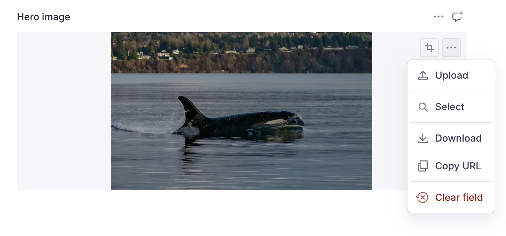
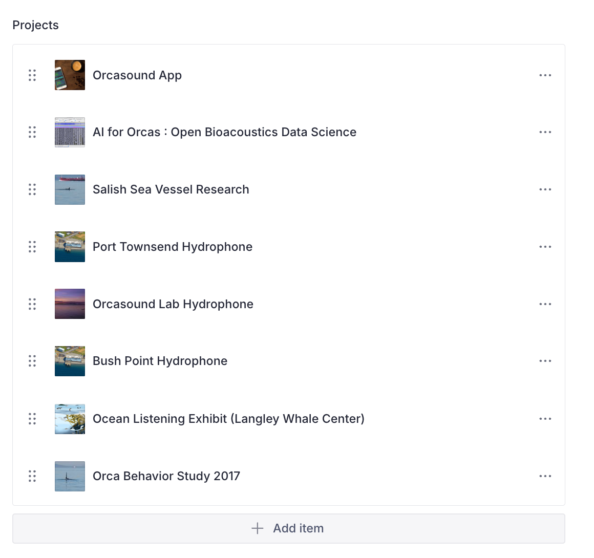
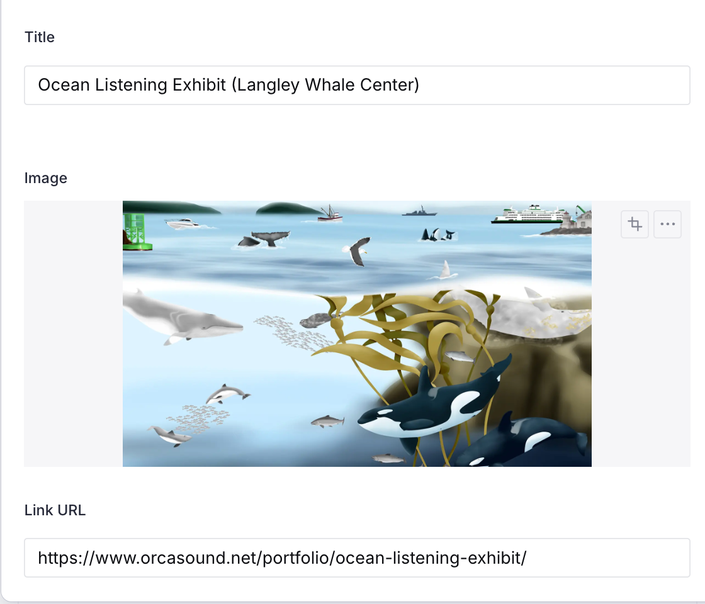

# Editing the About page (Sanity CMS guide)

This guide is for **content editors** (no coding needed). The About page on
orcasound.tech pulls its text and images from **Sanity**, a content management
system (CMS). You edit everything in the Sanity Studio — a website — and your
changes appear on the live site automatically.

> **You do not touch any code.** Everything here happens in the Studio.

---

## 1. Open the Studio and sign in

1. Go to **https://orcahome.sanity.studio**
2. Sign in with the Google account that was given access (ask an admin if you
   can't get in).

## 2. Open the About Page

1. In the left sidebar, click **About Page**.
2. The document opens with all the editable fields.

---

## 3. The fields you can edit

| Field                        | What it controls                                 |
| ---------------------------- | ------------------------------------------------ |
| **Hero title**               | The big heading at the top (e.g. "About")        |
| **Hero description**         | The sentence under the heading                   |
| **Hero image**               | The large banner image at the top                |
| **Intro paragraph**          | The paragraph above the project cards            |
| **Projects heading**         | The "Our Projects" heading                       |
| **Projects**                 | The grid of project cards (image + title + link) |
| **Participation heading**    | "We Welcome Your Participation!"                 |
| **Participation paragraphs** | The paragraphs under that heading                |
| **CTA label / CTA link**     | The button text and where it goes                |

### Editing text

Click any text field and type. That's it.

### Changing the hero image

1. Click the **Hero image** field.
2. Click **remove** on the current image, then drag a new image in (or click to
   upload).
3. Optional: drag the crop/hotspot to control how it's framed.

---

## 4. Editing the project cards

The **Projects** field is the grid of 8 cards. Each card = an **image + title +
link**.

- **Reorder**: drag a card up or down by the handle.
- **Edit a card**: click it to open, then change the Title, Image, or Link URL.
- **Change a card's image**: inside the card, remove the current image and drag
  in a new one.
- **Add a card**: click **Add item** at the bottom of the list.
- **Remove a card**: click the **⋮** menu on a card → Remove.

Each card's fields:

| Field        | Example                                            |
| ------------ | -------------------------------------------------- |
| **Title**    | "Orcasound App"                                    |
| **Image**    | (uploaded photo)                                   |
| **Link URL** | https://www.orcasound.net/portfolio/orcasound-app/ |

---

## 5. Publish your changes

Nothing goes live until you **publish**.

1. Click the green **Publish** button (bottom of the document).
2. If you see **"Unpublished changes"**, it means you have edits that are NOT
   live yet — click **Publish** to push them.

> ⚠️ **Don't leave edits as an unpublished draft.** If a draft sits there
> unpublished, the live site keeps showing the old content. Always click
> **Publish** when you're done.

## 6. When will it show on the site?

After you publish, the live site updates **within about a minute**. Refresh the
page (a hard refresh — Cmd/Ctrl + Shift + R) to see it. You do **not** need a
developer to deploy anything.

---

## Troubleshooting

| Problem                                                | What's going on                                                                                                                                                   |
| ------------------------------------------------------ | ----------------------------------------------------------------------------------------------------------------------------------------------------------------- |
| "I edited it but the site still shows the old version" | Either you didn't **Publish**, or the ~1 minute refresh window hasn't passed. Check for an "Unpublished changes" indicator, publish, wait a minute, hard-refresh. |
| "A field looks empty in the Studio"                    | If a field is left blank, the site falls back to its built-in default text/image. Fill the field in the Studio to override it.                                    |
| "I can't sign in"                                      | Ask an admin to grant your Google account access to the Sanity project.                                                                                           |

---

_Questions or something looks broken? Ping the dev channel._
