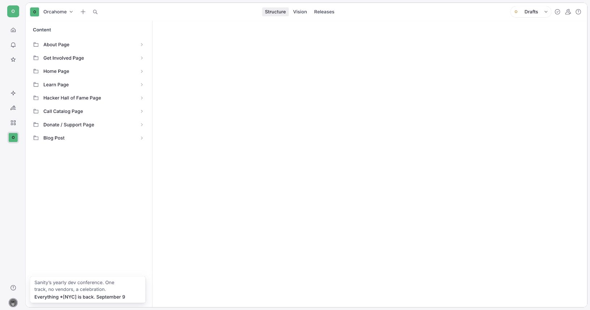
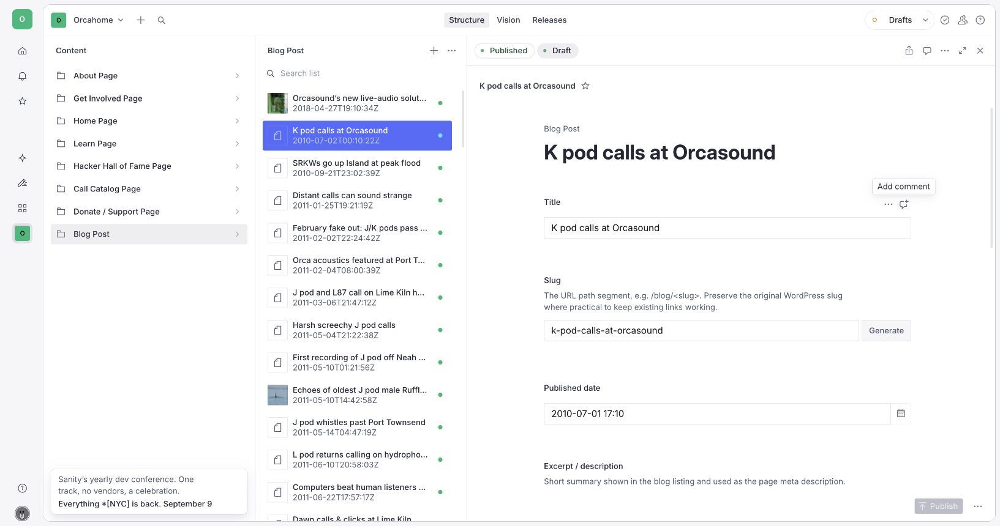
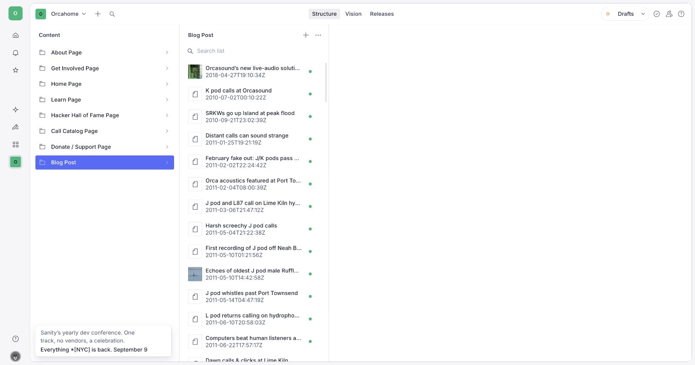
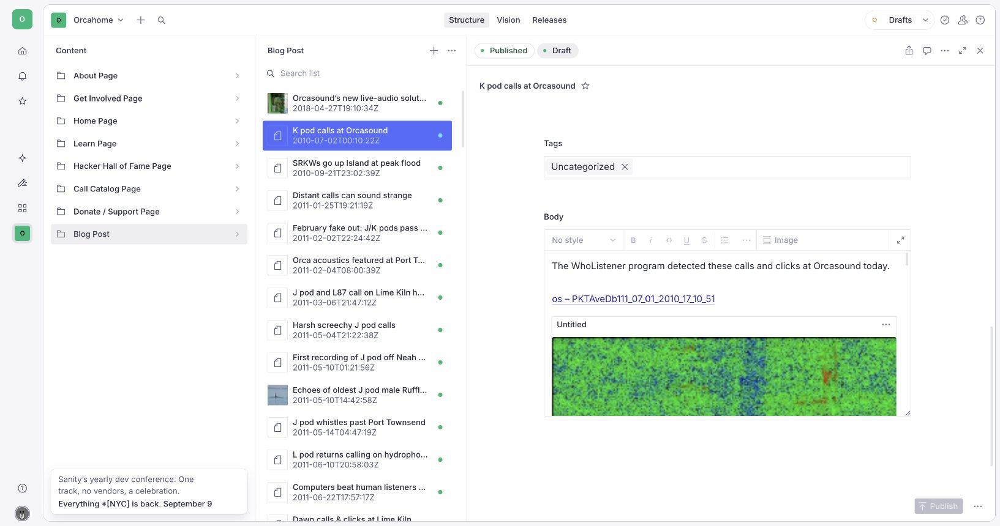

# Editing the Blog (Sanity CMS guide)

This guide shows you how to write, edit, and publish blog posts on
orcasound.tech using Sanity Studio — no code required. Unlike the other pages
(which have fixed fields you fill in), the blog is a **collection of posts**:
you can add new posts, edit existing ones, and publish them yourself.

---

## 1. Open the Studio and sign in

1. Go to **https://orcahome.sanity.studio**
2. Sign in with the Google account that was given access (ask an admin if you
   can't get in — ping @Vicky on Zulip).

## 2. Open the Blog

1. In the left sidebar, click **Blog Post**.
2. You'll see the list of all existing posts (including the ones brought over
   from the old WordPress blog), newest first.

- **To edit an existing post**, click it in the list.
- **To write a new post**, see [section 4](#4-write-a-new-post).

---

## 3. The fields in a post

When you open (or create) a post, these are the fields you fill in:

| Field              | What it's for                                                                      |
| ------------------ | ---------------------------------------------------------------------------------- |
| **Title**          | The headline of the post.                                                          |
| **Slug**           | The web address of the post: `orcasound.tech/blog/your-slug`. See the note below.  |
| **Published date** | The date shown on the post and used to sort the blog (newest first).               |
| **Excerpt**        | A one- or two-sentence summary. Shows in the blog list and in search results.      |
| **Featured image** | The main image shown at the top of the post and on its card in the blog list.      |
| **Tags**           | Short labels (e.g. "community", "engineering"). Shown as little chips on the post. |
| **Body**           | The main content of the post — see [section 5](#5-writing-the-body).               |

> **About the Slug (the web address):**
> The slug is the last part of the post's link. For a new post, click
> **Generate** next to the Slug field to create one automatically from the
> title. For posts brought over from WordPress, **leave the slug as-is** —
> changing it will break existing links to that post.

---

## 4. Write a new post

1. Click **Blog Post** in the left sidebar.
2. Click the **＋ / Create new** button (top of the list).

   

3. Fill in the fields from [section 3](#3-the-fields-in-a-post):
   - Type a **Title**.
   - Click **Generate** to make the **Slug** from the title.
   - Set the **Published date**.
   - Write a short **Excerpt**.
   - Add a **Featured image** (drag an image in, or click to upload).
   - Add any **Tags**.
   - Write the **Body** (next section).
4. **Publish** when you're done (see [section 6](#6-publish-your-post)).

---

## 5. Writing the Body

The **Body** is the main text of the post. It works like a simple word
processor: type your text, and use the toolbar to format it.

You can:

- **Bold / italic** text, add **headings**, and make **bulleted or numbered
  lists** using the toolbar.
- **Add a link**: select some text, then click the link button and paste the
  URL.
- **Add an image inside the post**: use the toolbar's image / "add" option and
  upload or drag an image in. (This is separate from the Featured image at the
  top.)

Just keep typing to add paragraphs — press Enter for a new paragraph.

---

## 6. Publish your post

Nothing goes live until you **publish**.

1. Click the green **Publish** button at the bottom of the post.
2. If you see **"Unpublished changes"**, it means you have edits that are NOT
   live yet — click **Publish** to push them.

> ⚠️ **Don't leave edits as an unpublished draft.** If a draft sits there
> unpublished, the live site won't show it (or keeps showing the old version).
> Always click **Publish** when you're done.

**To unpublish / hide a post:** open it, click the **⋮** menu next to Publish,
and choose **Unpublish**. It will disappear from the blog.

## 7. When will it show on the site?

After you publish, the blog updates **within about a minute**. Go to
**orcasound.tech/blog**, and hard-refresh (Cmd/Ctrl + Shift + R) to see it. New
posts appear at the top of the list. You do **not** need a developer to deploy
anything.

---

## Troubleshooting

| Problem                                             | What's going on                                                                                                                                    |
| --------------------------------------------------- | -------------------------------------------------------------------------------------------------------------------------------------------------- |
| "I published a post but it's not on the blog"       | Give it ~1 minute, then hard-refresh `orcasound.tech/blog`. Check the post actually shows **Published** (not "Unpublished changes") in the Studio. |
| "My post has no image on its card"                  | Add a **Featured image** — that's the image used on the blog list and at the top of the post.                                                      |
| "The post link (URL) is wrong or broke an old link" | The URL comes from the **Slug**. Don't change the slug of an existing/migrated post. For new posts, use **Generate** to make one from the title.   |
| "I can't sign in"                                   | Ask an admin to grant your Google account access to the Sanity project.                                                                            |

---

_Questions or something looks broken? ping @Vicky on Zulip._
