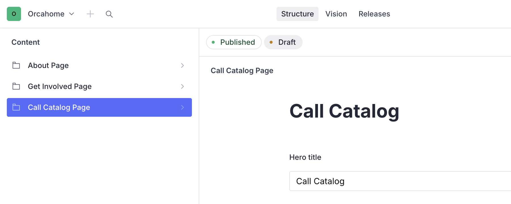
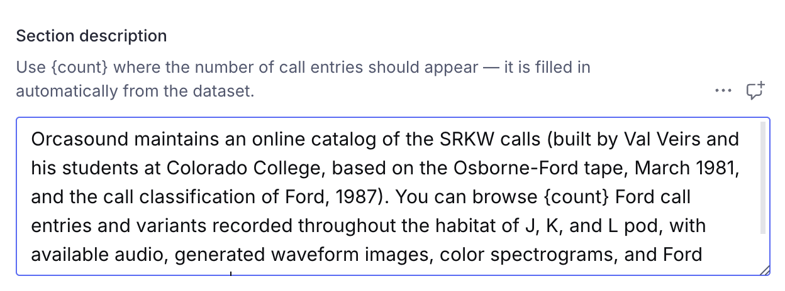
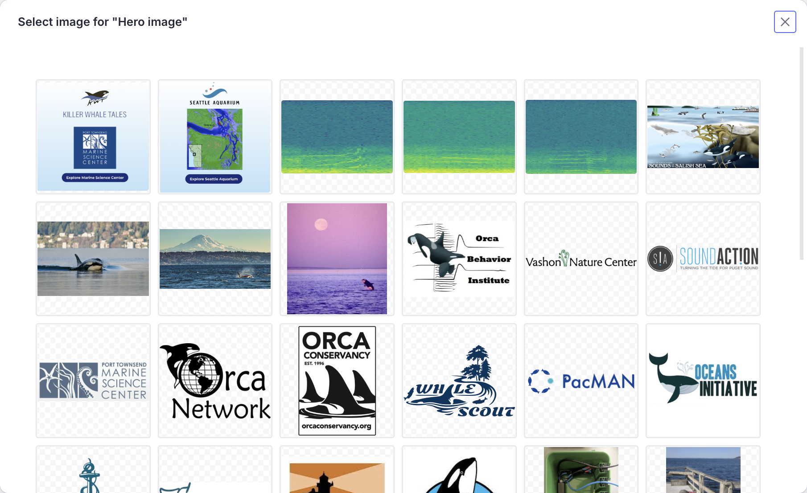
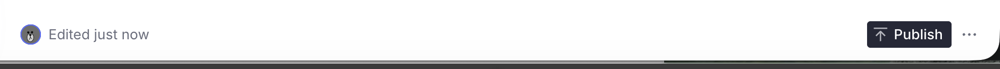

# Editing the Call Catalog page (Sanity CMS guide)

This guide walks you through editing the Call Catalog page copy on
orcasound.tech using Sanity Studio — the hero, the section title and
description, and the image credit — all without touching any code.

> **What is NOT edited here:** the catalog of call entries itself (the audio,
> waveforms, and spectrograms for each call) is a fixed scientific dataset and
> is **not** managed in Sanity. Only the surrounding page text is editable.

---

## 1. Open the Studio and sign in

1. Go to **https://orcahome.sanity.studio**
2. Sign in with the Google account that was given access (ask an admin if you
   can't get in — ping @Vicky on Zulip).

## 2. Open the Call Catalog Page

1. In the left sidebar, click **Call Catalog Page**.
2. The document opens with all the editable fields.

---

## 3. The fields you can edit

| Field                   | What it controls                                         |
| ----------------------- | -------------------------------------------------------- |
| **Hero title**          | The big title on the top banner (e.g. "Call Catalog")    |
| **Hero description**    | Optional sentence under the banner title                 |
| **Hero image**          | The top banner image                                     |
| **Section title**       | The heading above the call list                          |
| **Section description** | The intro paragraph above the call list (see note below) |
| **Image credit line**   | The credit line at the bottom of the page                |

### The `{count}` placeholder

In the **Section description**, write **`{count}`** wherever the number of call
entries should appear. It's filled in automatically from the dataset, so the
number stays correct even if the catalog changes — you don't type the number
yourself.

_Example:_ "You can browse `{count}` Ford call entries…" renders as "You can
browse 48 Ford call entries…".

### Editing text

Click any text field and type. That's it.

---

## 4. Changing the hero image

1. Click the **Hero image** field.
2. Click **remove** on the current image, then drag a new image in (or click to
   upload).
3. Optional: drag the crop/hotspot to control how it's framed.

> **If you leave the image blank**, the site falls back to the original built-in
> photo — nothing breaks.

---

## 5. Publish your changes

Nothing goes live until you **publish**.

1. Click the green **Publish** button (bottom of the document).
2. If you see **"Unpublished changes"**, it means you have edits that are NOT
   live yet — click **Publish** to push them.

> ⚠️ **Don't leave edits as an unpublished draft.** If a draft sits there
> unpublished, the live site keeps showing the old content. Always click
> **Publish** when you're done.

## 6. When will it show on the site?

After you publish, the live site (orcasound.tech) updates **within about a
minute**. Refresh the page (a hard refresh — Cmd/Ctrl + Shift + R) to see it.
You do **not** need a developer to deploy anything.

---

## Troubleshooting

| Problem                                                | What's going on                                                                                                                                                                     |
| ------------------------------------------------------ | ----------------------------------------------------------------------------------------------------------------------------------------------------------------------------------- |
| "I edited it but the site still shows the old version" | Either you didn't **Publish**, or the ~1 minute refresh window hasn't passed. Check for an "Unpublished changes" indicator, publish, wait a minute, hard-refresh.                   |
| "A field looks empty in the Studio"                    | If a field is left blank, the site falls back to its built-in default text/image. Fill the field in the Studio to override it.                                                      |
| "The number of calls is wrong / shows `{count}`"       | Keep the literal `{count}` token in the description — the site swaps it for the real number. If it shows `{count}` on the live site, that's expected only if the token was altered. |
| "I can't sign in"                                      | Ask an admin to grant your Google account access to the Sanity project.                                                                                                             |

---

_Questions or something looks broken? ping @Vicky on Zulip._
