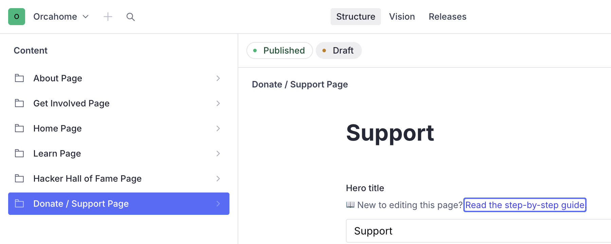
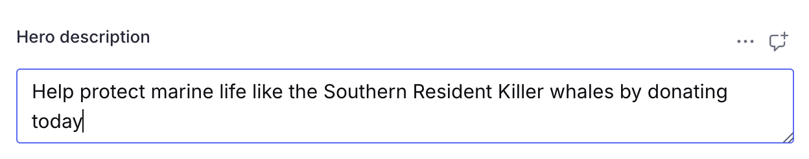
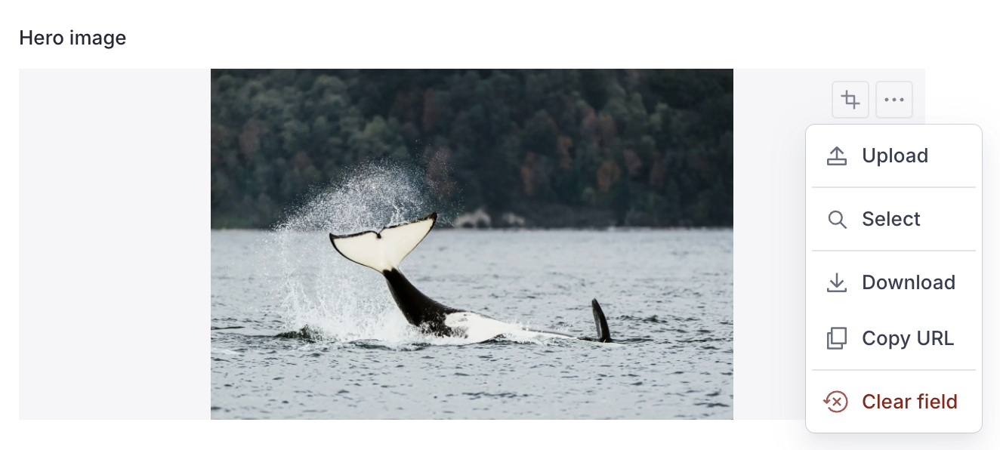
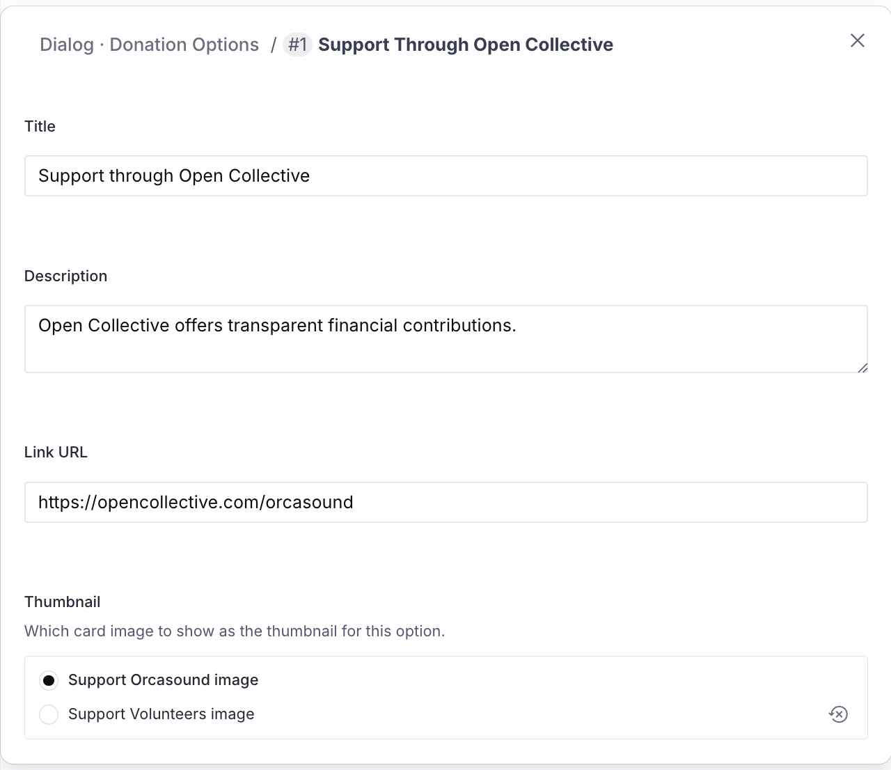
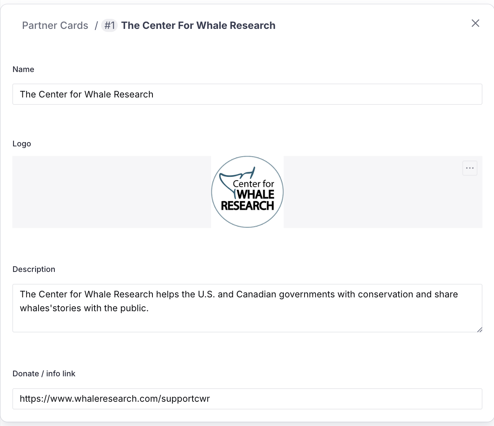
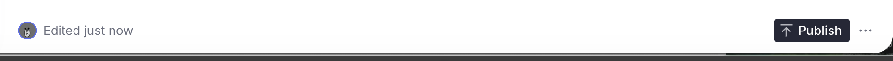

# Editing the Donate / Support page (Sanity CMS guide)

This guide walks you through editing the Support page copy on orcasound.tech
using Sanity Studio — the hero and the two support cards — all without touching
any code.

> **What is NOT edited here:** page layout, styling, and analytics stay in code.
> Everything else on the page — the hero, the two support cards, the "Ways to
> Support" pop-up, and the 501(c)3 partner cards — is editable in Sanity.

---

## 1. Open the Studio and sign in

1. Go to **https://orcahome.sanity.studio**
2. Sign in with the Google account that was given access (ask an admin if you
   can't get in — ping @Vicky on Zulip).

## 2. Open the Donate / Support Page

1. In the left sidebar, click **Donate / Support Page**.
2. The document opens with all the editable fields.

---

## 3. The fields you can edit

| Field                                            | What it controls                                        |
| ------------------------------------------------ | ------------------------------------------------------- |
| **Hero title**                                   | The big title on the top banner (e.g. "Support")        |
| **Hero description**                             | The sentence under the banner title                     |
| **Hero image**                                   | The top banner image                                    |
| **Support Orcasound · title / message / image**  | The left support card                                   |
| **Support Volunteers · title / message / image** | The right support card                                  |
| **Support Volunteers · button link**             | Where the right card's Support button goes              |
| **Dialog · title / subtitle / heading**          | The "Ways to Support" pop-up headings                   |
| **Dialog · donation options**                    | The clickable support methods in the pop-up (see §6)    |
| **Partners section · title / description**       | The heading above the partner cards                     |
| **Partner cards**                                | The 501(c)3 partner cards — logo, name, text, link (§7) |

### Editing text

Click any text field and type. That's it.

---

## 4. Changing an image

This works the same for the **Hero image** and the two card images.

1. Click the image field.
2. Click **remove** on the current image, then drag a new image in (or click to
   upload).
3. Optional: drag the crop/hotspot to control how it's framed.

> **If you leave an image blank**, the site falls back to the original built-in
> photo — nothing breaks.

---

## 5. Editing the "Ways to Support" pop-up

The pop-up that opens when someone clicks **Support** has its own editable
copy — the **Dialog · title / subtitle / heading** fields — plus a list of
**donation options**.

Each donation option (e.g. Open Collective, GitHub) has:

| Field           | What it's for                                              |
| --------------- | ---------------------------------------------------------- |
| **Title**       | The option's name (e.g. "Support through Open Collective") |
| **Description** | The short line under the title                             |
| **Link URL**    | Where the option links to                                  |
| **Thumbnail**   | Which card image to reuse as the option's thumbnail        |

- **Edit an option**: click it to open, then change the fields.
- **Add / remove / reorder**: use **Add item**, the **⋮** menu, or the drag
  handle.

---

## 6. Editing the partner cards

The **Partner cards** field is the list of 501(c)3 partners near the bottom of
the page. Each card = a **logo + name + description + link**.

| Field                  | What it's for                           |
| ---------------------- | --------------------------------------- |
| **Name**               | The partner's name                      |
| **Logo**               | The partner's logo image                |
| **Description**        | The short description on the card       |
| **Donate / info link** | Where the card's "Learn more" link goes |

- **Edit a partner**: click it to open its fields.
- **Change the logo**: remove the current image and drag in a new one.
- **Add / remove / reorder**: use **Add item**, the **⋮** menu, or the drag
  handle.

> **If the partner list is left empty**, the site falls back to its built-in
> partner cards — nothing breaks.

---

## 7. Publish your changes

Nothing goes live until you **publish**.

1. Click the green **Publish** button (bottom of the document).
2. If you see **"Unpublished changes"**, it means you have edits that are NOT
   live yet — click **Publish** to push them.

> ⚠️ **Don't leave edits as an unpublished draft.** If a draft sits there
> unpublished, the live site keeps showing the old content. Always click
> **Publish** when you're done.

## 8. When will it show on the site?

After you publish, the live site (orcasound.tech) updates **within about a
minute**. Refresh the page (a hard refresh — Cmd/Ctrl + Shift + R) to see it.
You do **not** need a developer to deploy anything.

---

## Troubleshooting

| Problem                                                | What's going on                                                                                                                                                   |
| ------------------------------------------------------ | ----------------------------------------------------------------------------------------------------------------------------------------------------------------- |
| "I edited it but the site still shows the old version" | Either you didn't **Publish**, or the ~1 minute refresh window hasn't passed. Check for an "Unpublished changes" indicator, publish, wait a minute, hard-refresh. |
| "A field looks empty in the Studio"                    | If a field is left blank, the site falls back to its built-in default text/image. Fill the field in the Studio to override it.                                    |
| "I want to change a partner logo"                      | Partner logos aren't in Sanity yet — those still live in the code's data file. Ask a developer.                                                                   |
| "I can't sign in"                                      | Ask an admin to grant your Google account access to the Sanity project.                                                                                           |

---

_Questions or something looks broken? ping @Vicky on Zulip._
