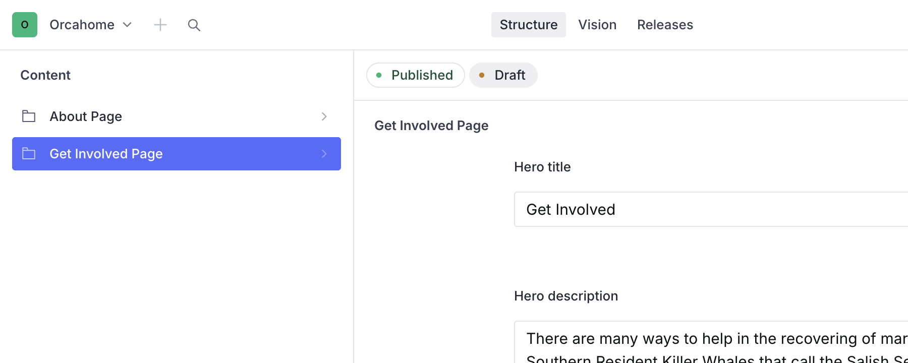
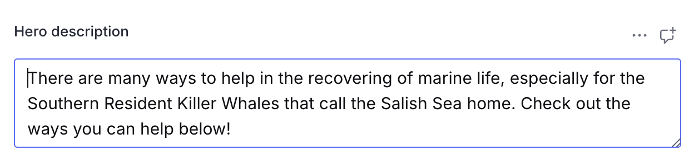
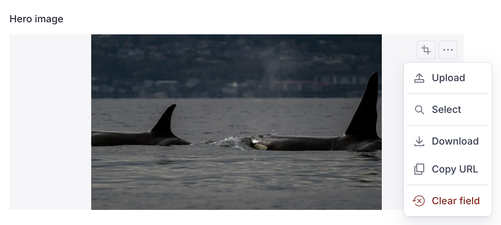
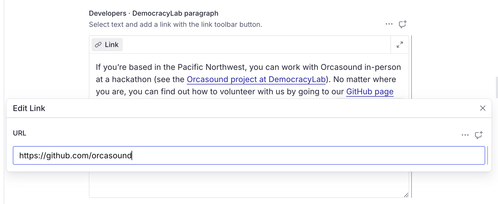
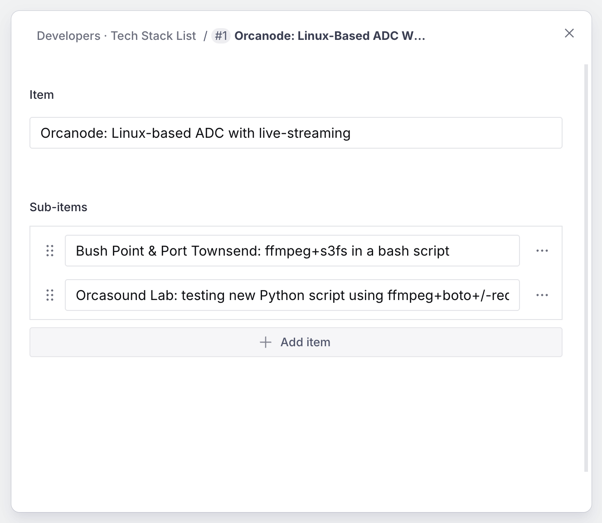
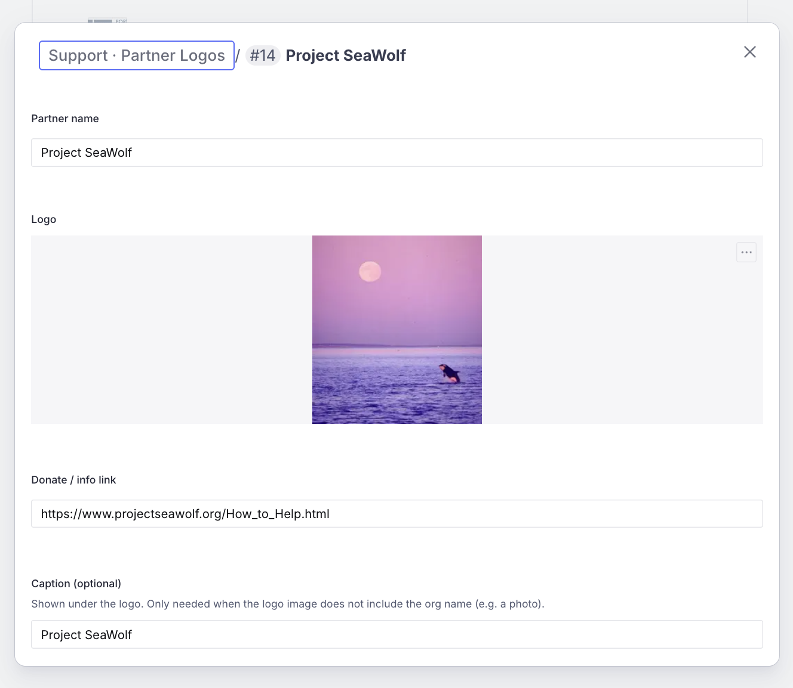
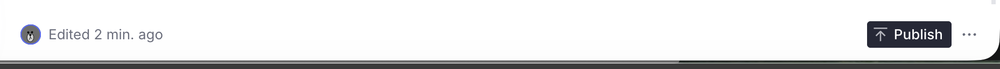

# Editing the Get Involved page (Sanity CMS guide)

This guide walks you through editing the Get Involved page on orcasound.tech
using Sanity Studio. You'll learn how to update text, swap images, edit the
links inside the rich-text paragraphs, and manage the tech-stack and partner
lists — all without touching any code.

---

## 1. Open the Studio and sign in

1. Go to **https://orcahome.sanity.studio**
2. Sign in with the Google account that was given access (ask an admin if you
   can't get in — ping @Vicky on Zulip).

## 2. Open the Get Involved Page

1. In the left sidebar, click **Get Involved Page**.
2. The document opens with all the editable fields.

---

## 3. The fields you can edit

| Field                                                   | What it controls                                         |
| ------------------------------------------------------- | -------------------------------------------------------- |
| **Hero title / description / image**                    | The big banner at the top of the page                    |
| **Volunteer · Citizen Scientist / In Person**           | The two headings + paragraphs in the Volunteer section   |
| **Volunteer photos**                                    | The grid of up to 4 photos in the Volunteer section      |
| **Volunteer closing paragraph**                         | The paragraph under the volunteer photos                 |
| **Developers · intro / crowning jewel**                 | The Developers section paragraphs                        |
| **Orcasound Web App heading + hackathon photo/caption** | The photo block in the Developers section                |
| **Tech stack list**                                     | The bulleted tech-stack list (with nested sub-items)     |
| **Roadmap heading / image / caption**                   | The zoomable roadmap image and its text                  |
| **DemocracyLab paragraph**                              | The rich-text paragraph with links (see section 5)       |
| **MOA heading / paragraphs**                            | The Memorandum of Agreement block (rich text, section 5) |
| **Support paragraphs / button**                         | The Support section text and "Support Now" button        |
| **Partner logos**                                       | The grid of partner logos (image + name + link)          |

### Editing text

Click any text field and type. That's it.

---

## 4. Changing images

This works the same for the **Hero image**, the **Volunteer photos**, the
**hackathon photo**, and the **roadmap image**.

1. Click the image field.
2. Click **remove** on the current image, then drag a new image in (or click to
   upload).
3. Optional: drag the crop/hotspot to control how it's framed.

> **If you leave an image blank**, the site falls back to the original built-in
> photo — nothing breaks.

---

## 5. Editing links inside the rich-text paragraphs

Two fields — **DemocracyLab paragraph** and **MOA paragraphs** — are _rich text_.
In these, some words are clickable links (e.g. "GitHub page", "Orcasound project
at DemocracyLab"). The plain text you edit like anything else; the links need a
couple of extra clicks.

**To edit an existing link's address or wording:**

1. Click into the linked words (they're underlined/highlighted).
2. A small toolbar appears above the text — click the **link icon** to open the
   link, then change the **URL**.
3. To change the visible words, just retype them like normal text.

**To add a new link:**

1. Select the words you want to turn into a link.
2. Click the **link icon** in the toolbar that appears.
3. Enter the **URL** (a full `https://…` address, a `mailto:` email, or an
   internal path like `/hacker-hall-of-fame`).

**To remove a link:** click into it, open the link toolbar, and click the
**remove/trash** option — the words stay, the link is gone.

---

## 6. Editing the tech-stack list

The **Tech stack list** is a list of items, and each item can have a nested list
of **sub-items**.

- **Edit an item**: click it to open, then change the **Item** text.
- **Add sub-items**: inside an item, use the **Sub-items** list → **Add item**.
- **Reorder / remove**: drag by the handle, or use the **⋮** menu → Remove.
- **Add a new item**: click **Add item** at the bottom of the list.

---

## 7. Editing the partner logos

The **Partner logos** field is the grid at the bottom of the Support section.
Each partner = an **image + name + link (+ optional caption)**.

| Field                  | What it's for                                                                                                                |
| ---------------------- | ---------------------------------------------------------------------------------------------------------------------------- |
| **Partner name**       | Used for the image's alt text and analytics                                                                                  |
| **Logo**               | The logo image                                                                                                               |
| **Donate / info link** | Where clicking the logo goes                                                                                                 |
| **Caption (optional)** | Only fill this if the logo image doesn't show the org's name (e.g. a photo). It shows as an underlined label under the logo. |

- **Reorder**: drag a partner up or down by the handle.
- **Edit**: click a partner to open its fields.
- **Add**: click **Add item** at the bottom.
- **Remove**: click the **⋮** menu on a partner → Remove.

---

## 8. Publish your changes

Nothing goes live until you **publish**.

1. Click the green **Publish** button (bottom of the document).
2. If you see **"Unpublished changes"**, it means you have edits that are NOT
   live yet — click **Publish** to push them.

> ⚠️ **Don't leave edits as an unpublished draft.** If a draft sits there
> unpublished, the live site keeps showing the old content. Always click
> **Publish** when you're done.

## 9. When will it show on the site?

After you publish, the live site (orcasound.tech) updates **within about a
minute**. Refresh the page (a hard refresh — Cmd/Ctrl + Shift + R) to see it.
You do **not** need a developer to deploy anything.

---

## Troubleshooting

| Problem                                                | What's going on                                                                                                                                                   |
| ------------------------------------------------------ | ----------------------------------------------------------------------------------------------------------------------------------------------------------------- |
| "I edited it but the site still shows the old version" | Either you didn't **Publish**, or the ~1 minute refresh window hasn't passed. Check for an "Unpublished changes" indicator, publish, wait a minute, hard-refresh. |
| "A field looks empty in the Studio"                    | If a field is left blank, the site falls back to its built-in default text/image. Fill the field in the Studio to override it.                                    |
| "I broke a link and the text disappeared"              | Undo (Cmd/Ctrl + Z). Links live on top of the text — removing a link keeps the words; deleting the words removes both.                                            |
| "I can't sign in"                                      | Ask an admin to grant your Google account access to the Sanity project.                                                                                           |

---

_Questions or something looks broken? ping @Vicky on Zulip._
