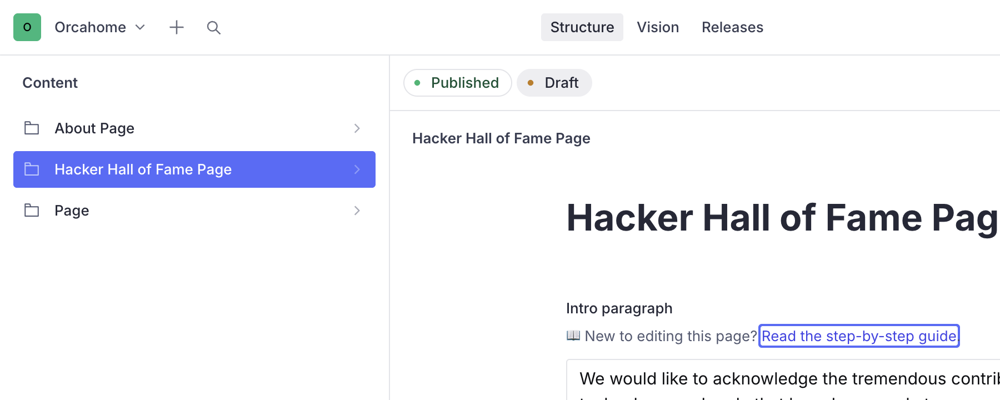
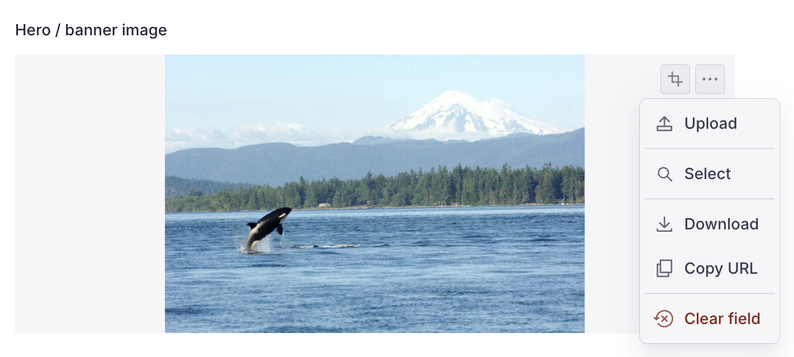
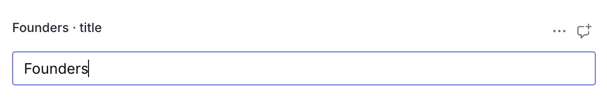
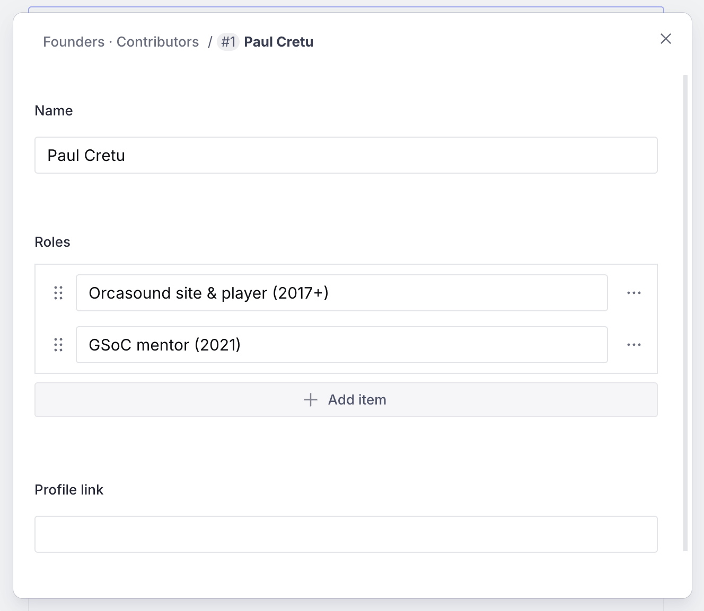
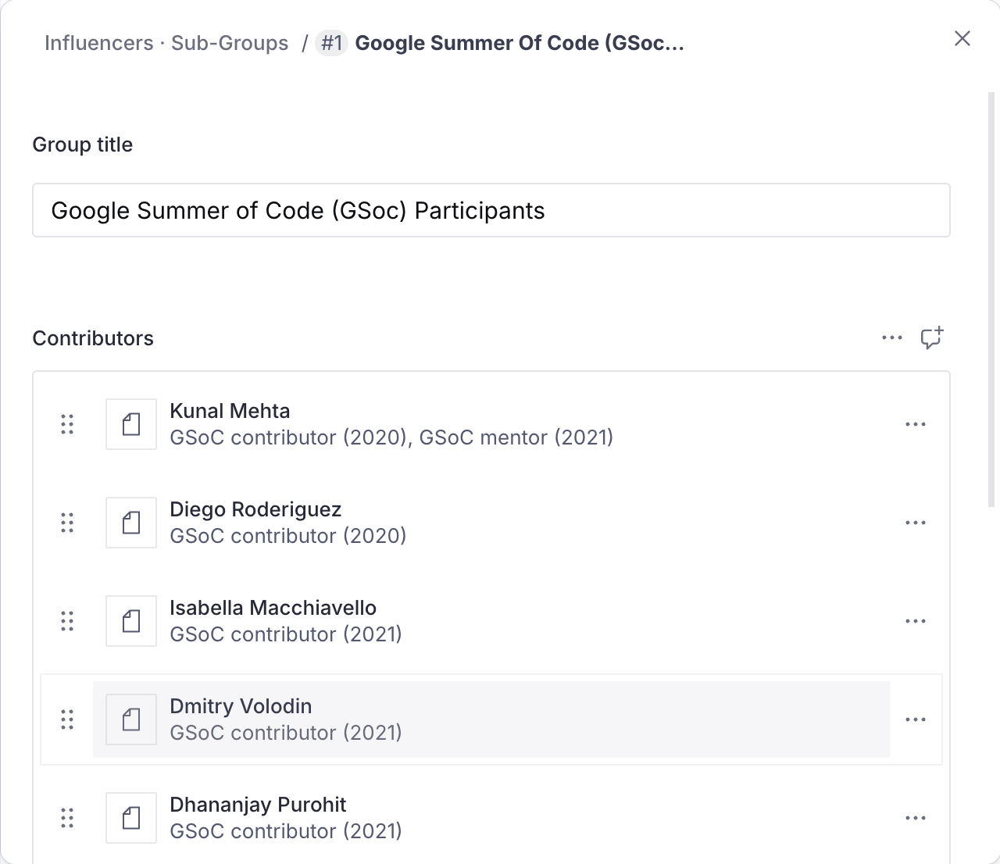
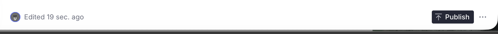

# Editing the Hacker Hall of Fame page (Sanity CMS guide)

This guide walks you through editing the Hacker Hall of Fame page on
orcasound.tech using Sanity Studio — updating the intro, the section titles, and
especially the **contributor lists** (adding people, changing roles, and wiring
their profile links) — all without touching any code.

---

## 1. Open the Studio and sign in

1. Go to **https://orcahome.sanity.studio**
2. Sign in with the Google account that was given access (ask an admin if you
   can't get in — ping @Vicky on Zulip).

## 2. Open the Hacker Hall of Fame Page

1. In the left sidebar, click **Hacker Hall of Fame Page**.
2. The document opens with all the editable fields.

---

## 3. What you can edit

| Field                                          | What it controls                                                                            |
| ---------------------------------------------- | ------------------------------------------------------------------------------------------- |
| **Hero title**                                 | The big title on the top banner ("Hacker Hall of Fame")                                     |
| **Hero / banner image**                        | The top banner photo                                                                        |
| **Thank-you banner message**                   | The navy bar under the banner ("Thank you, Orcasound App Hackers!")                         |
| **Hackathon photo + caption**                  | The photo in the intro section and its caption                                              |
| **Intro paragraph**                            | The first paragraph at the top of the page                                                  |
| **Founders · title / subtitle / contributors** | The Founders header and its list of people                                                  |
| **Influencers · title / subtitle**             | The Influencers header                                                                      |
| **Influencers · sub-groups**                   | The themed teams (GSoC, Live app, Arcatia, PM, …), each with its own title and contributors |
| **Podcast · title / subtitle / names**         | The PodCast header and the list of names                                                    |
| **OrcaHello · title / caption / contributors** | The OrcaHello section                                                                       |
| **Individual Contributors · title / list**     | The individual contributors section                                                         |
| **Supporters · title / list**                  | The supporters section                                                                      |
| **Lower photos (above footer)**                | The two photos above the footer, each with a caption                                        |

> The two lower intro paragraphs (with links) and the Founders description are
> fixed and not edited here.

### Changing an image

For any image field (banner, hackathon photo, lower photos): click the field,
click **remove** on the current image, then drag a new one in (or click to
upload). Leave it blank to keep the built-in photo.

### Editing text

Click any text field and type. That's it.

---

## 4. Editing a contributor (the important part)

Every list — Founders, each Influencer sub-group, OrcaHello, Individual
Contributors, Supporters — is a list of **contributors**. Each contributor has:

| Field            | What it's for                                                           |
| ---------------- | ----------------------------------------------------------------------- |
| **Name**         | The person's name (required)                                            |
| **Roles**        | One or more short role lines (e.g. "GSoC mentor (2021)")                |
| **Profile link** | Where their name links to (e.g. their GitHub). Leave blank for no link. |

- **Edit a person**: click them to open, then change Name / Roles / link.
- **Add a role line**: in the **Roles** list, click **Add item** and type.
- **Add a person**: click **Add item** at the bottom of the list.
- **Reorder / remove**: drag by the handle, or use the **⋮** menu → Remove.

---

## 5. Editing the Influencer sub-groups

The **Influencers · sub-groups** field is a list of themed teams. Each group has
its own **title** and its own **contributors** list.

- **Edit a group**: click it to open, change the **title**, or edit the
  contributors inside it (same as section 4).
- **Add / remove / reorder** groups with **Add item**, the **⋮** menu, or the
  drag handle.

---

## 6. Publish your changes

Nothing goes live until you **publish**.

1. Click the green **Publish** button (bottom of the document).
2. If you see **"Unpublished changes"**, it means you have edits that are NOT
   live yet — click **Publish** to push them.

> ⚠️ **Don't leave edits as an unpublished draft.** If a draft sits there
> unpublished, the live site keeps showing the old content. Always click
> **Publish** when you're done.

## 7. When will it show on the site?

After you publish, the live site (orcasound.tech) updates **within about a
minute**. Refresh the page (a hard refresh — Cmd/Ctrl + Shift + R) to see it.
You do **not** need a developer to deploy anything.

---

## Troubleshooting

| Problem                                                | What's going on                                                                                                                                                   |
| ------------------------------------------------------ | ----------------------------------------------------------------------------------------------------------------------------------------------------------------- |
| "I edited it but the site still shows the old version" | Either you didn't **Publish**, or the ~1 minute refresh window hasn't passed. Check for an "Unpublished changes" indicator, publish, wait a minute, hard-refresh. |
| "A section looks empty in the Studio"                  | If a list is left empty, the site falls back to its built-in contributor list. Fill the list in the Studio to override it.                                        |
| "A name isn't a clickable link"                        | That contributor's **Profile link** is blank. Add a URL to make the name link.                                                                                    |
| "I can't sign in"                                      | Ask an admin to grant your Google account access to the Sanity project.                                                                                           |

---

_Questions or something looks broken? ping @Vicky on Zulip._
