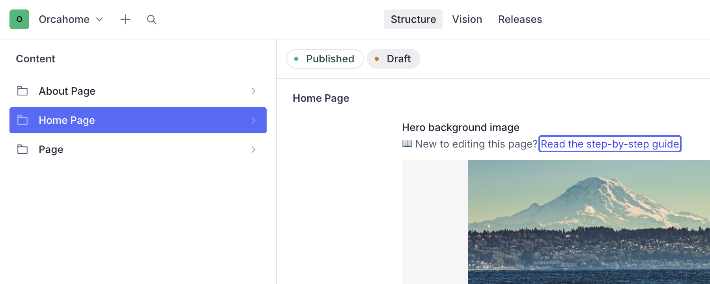
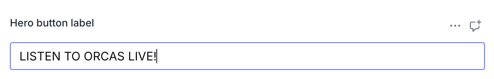
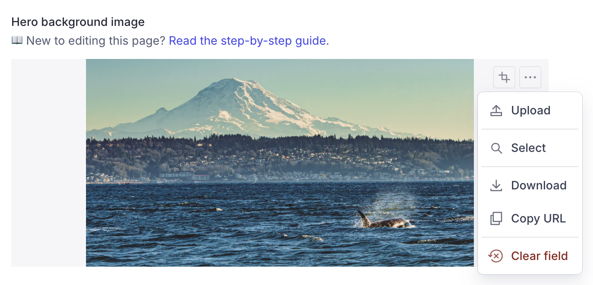
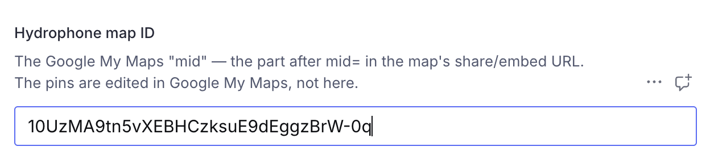
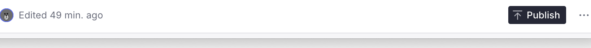

# Editing the Home page (Sanity CMS guide)

This guide walks you through editing the Home page on orcasound.tech using
Sanity Studio. You'll learn how to update the hero, the "What is Orcasound" and
"Hydrophone Locations" copy, the call-to-action buttons, and which map is
embedded — all without touching any code.

---

## 1. Open the Studio and sign in

1. Go to **https://orcahome.sanity.studio**
2. Sign in with the Google account that was given access (ask an admin if you
   can't get in — ping @Vicky on Zulip).

## 2. Open the Home Page

1. In the left sidebar, click **Home Page**.
2. The document opens with all the editable fields.

---

## 3. The fields you can edit

| Field                                               | What it controls                                |
| --------------------------------------------------- | ----------------------------------------------- |
| **Hero background image**                           | The full-screen orca photo at the top           |
| **Hero button label / link**                        | The big black "LISTEN TO ORCAS LIVE!" button    |
| **"What is Orcasound" heading**                     | The section heading below the hero              |
| **"What is Orcasound" paragraphs**                  | The paragraphs under that heading               |
| **"Hydrophone Locations" heading**                  | The heading next to the map                     |
| **Hydrophone Locations · intro / second paragraph** | The two paragraphs next to the map              |
| **Hydrophone map ID**                               | Which Google My Map is embedded (see section 6) |
| **Listen Live button label / link**                 | The "LISTEN LIVE" button                        |
| **Get Involved button label / link**                | The "GET INVOLVED" button                       |

### Editing text

Click any text field and type. That's it.

---

## 4. Changing the hero image

1. Click the **Hero background image** field.
2. Click **remove** on the current image, then drag a new image in (or click to
   upload).
3. Optional: drag the crop/hotspot to control how it's framed.

> **If you leave the image blank**, the site falls back to the original built-in
> photo — nothing breaks.

---

## 5. The call-to-action buttons

There are three buttons on the Home page, each with an editable **label** (the
words on the button) and **link** (where it goes):

- **Hero button** — the big black button in the hero (default: "LISTEN TO ORCAS
  LIVE!" → live.orcasound.net).
- **Listen Live** — default → live.orcasound.net/listen.
- **Get Involved** — default → the /getinvolved page on this site.

Just edit the label / link fields. Internal links start with a slash (e.g.
`/getinvolved`); external links are full `https://…` addresses.

---

## 6. Changing which map is embedded

The **Hydrophone Locations** map is a **Google My Map**. Two things to know:

- **The pins (hydrophone locations) are edited in Google My Maps, NOT here.**
  Add or move pins in the map itself at
  [google.com/mymaps](https://www.google.com/mymaps).
- The only thing Sanity controls is **which map** is embedded, via the **Hydrophone
  map ID** field.

**To get a map ID:** open the map in Google My Maps — the browser address bar
reads `https://www.google.com/maps/d/edit?mid=XXXX&...`. The **`mid`** is the
part after `mid=` (up to the `&`). Paste that into the field.

> The map must be shared publicly ("Anyone with the link") for the embed to
> work. You only need to touch this field when swapping in a whole new map.

---

## 7. Publish your changes

Nothing goes live until you **publish**.

1. Click the green **Publish** button (bottom of the document).
2. If you see **"Unpublished changes"**, it means you have edits that are NOT
   live yet — click **Publish** to push them.

> ⚠️ **Don't leave edits as an unpublished draft.** If a draft sits there
> unpublished, the live site keeps showing the old content. Always click
> **Publish** when you're done.

## 8. When will it show on the site?

After you publish, the live site (orcasound.tech) updates **within about a
minute**. Refresh the page (a hard refresh — Cmd/Ctrl + Shift + R) to see it.
You do **not** need a developer to deploy anything.

---

## Troubleshooting

| Problem                                                | What's going on                                                                                                                                                   |
| ------------------------------------------------------ | ----------------------------------------------------------------------------------------------------------------------------------------------------------------- |
| "I edited it but the site still shows the old version" | Either you didn't **Publish**, or the ~1 minute refresh window hasn't passed. Check for an "Unpublished changes" indicator, publish, wait a minute, hard-refresh. |
| "A field looks empty in the Studio"                    | If a field is left blank, the site falls back to its built-in default text/image. Fill the field in the Studio to override it.                                    |
| "The map is blank or won't embed"                      | The Google My Map must be shared publicly ("Anyone with the link"), and the map ID must be the value after `mid=`.                                                |
| "I can't sign in"                                      | Ask an admin to grant your Google account access to the Sanity project.                                                                                           |

---

_Questions or something looks broken? ping @Vicky on Zulip._
