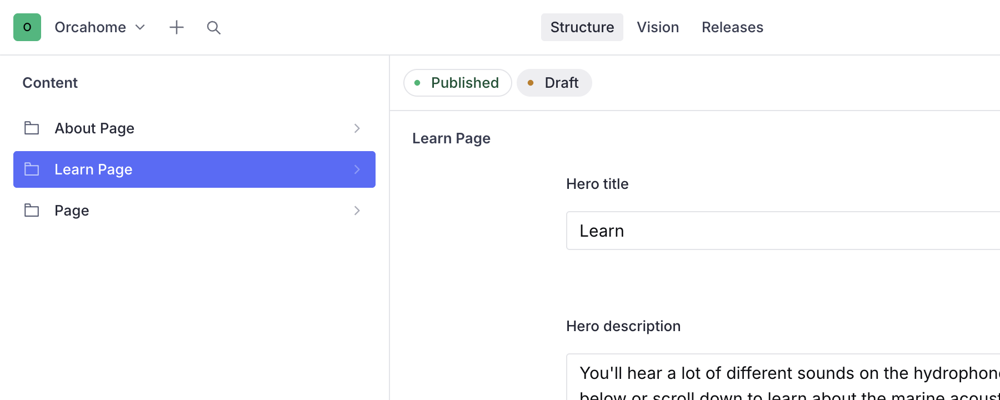
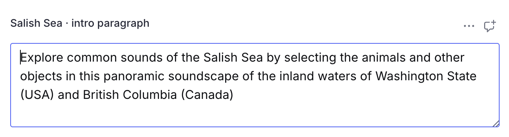
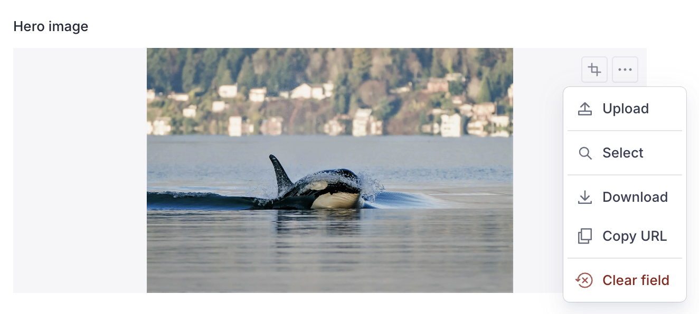
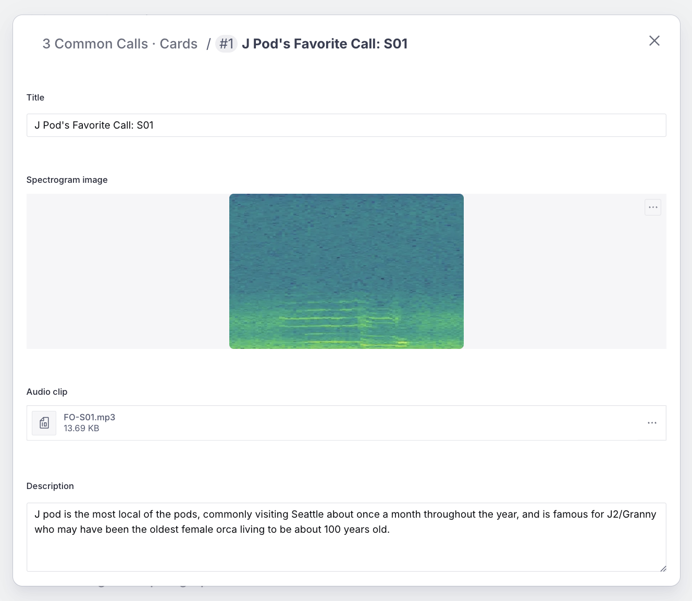
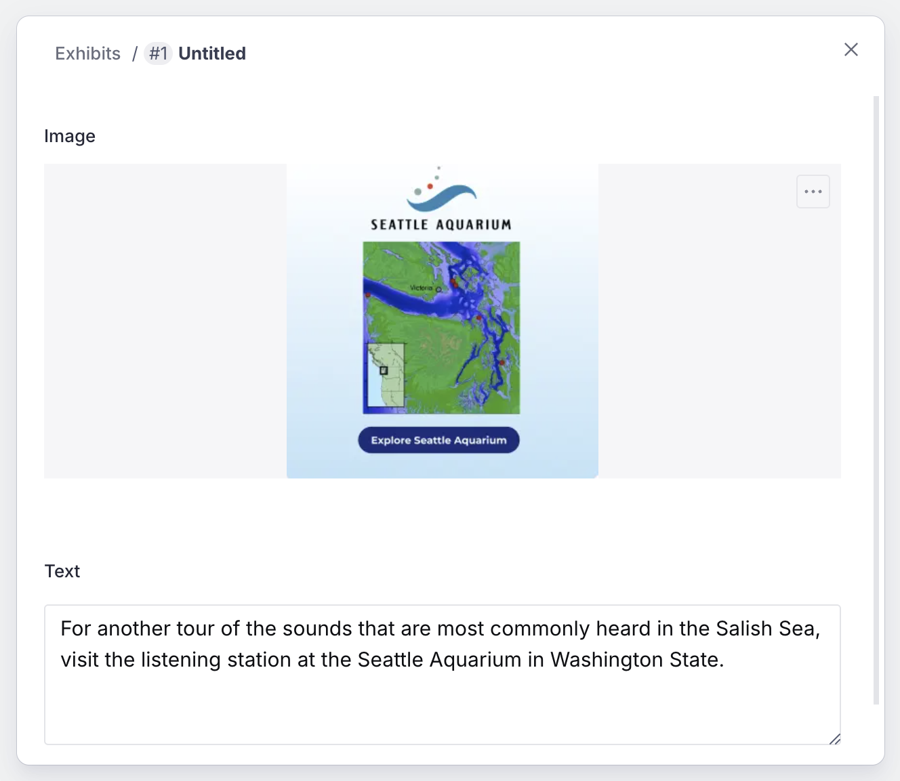

# Editing the Learn page (Sanity CMS guide)

This guide walks you through editing the Learn page on orcasound.tech using
Sanity Studio. You'll learn how to update the hero, the section intros, the
soundscape image, the 3 Common Calls cards (image + audio + text), and the
exhibits — all without touching any code.

---

## 1. Open the Studio and sign in

1. Go to **https://orcahome.sanity.studio**
2. Sign in with the Google account that was given access (ask an admin if you
   can't get in — ping @Vicky on Zulip).

## 2. Open the Learn Page

1. In the left sidebar, click **Learn Page**.
2. The document opens with all the editable fields.

---

## 3. The fields you can edit

| Field                                    | What it controls                                        |
| ---------------------------------------- | ------------------------------------------------------- |
| **Hero title / description / image**     | The banner at the top of the page                       |
| **Salish Sea · intro paragraph**         | The paragraph in the "Sounds of the Salish Sea" section |
| **Salish Sea · soundscape image / link** | The panoramic soundscape image and where it links to    |
| **3 Common Calls · intro paragraph**     | The paragraph under the "3 Common Calls" heading        |
| **3 Common Calls · cards**               | The three call cards (image + audio + text)             |
| **Call Catalog · intro paragraph**       | The paragraph above the call-catalog grid               |
| **Exhibits**                             | The exhibit blocks (image + text)                       |

> The interactive **Call Catalog grid** and the closing "Orcasound YouTube
> channel" sentence are fixed and not edited here.

### Editing text

Click any text field and type. That's it.

---

## 4. Changing images

This works the same for the **Hero image** and the **Salish Sea soundscape
image**.

1. Click the image field.
2. Click **remove** on the current image, then drag a new image in (or click to
   upload).
3. Optional: drag the crop/hotspot to control how it's framed.

> **If you leave an image blank**, the site falls back to the original built-in
> photo — nothing breaks.

---

## 5. Editing the 3 Common Calls cards

The **3 Common Calls · cards** field is the list of call cards. Each card holds
a **title**, a **spectrogram image**, an **audio clip**, and a **description**.

- **Edit a card**: click it to open, then change the fields.
- **Change the spectrogram**: remove the current image and drag in a new one.
- **Change the audio clip**: in the **Audio clip** field, remove the current
  file and upload a new audio file (mp3).
- **Reorder / remove**: drag by the handle, or use the **⋮** menu → Remove.
- **Add a card**: click **Add item** at the bottom of the list.

---

## 6. Editing the exhibits

The **Exhibits** field is the list of exhibit blocks at the bottom of the page.
Each = an **image + text**.

- **Edit**: click an exhibit to open its image and text.
- **Add / remove / reorder**: use **Add item**, the **⋮** menu, or the drag
  handle.

---

## 7. Publish your changes

Nothing goes live until you **publish**.

1. Click the green **Publish** button (bottom of the document).
2. If you see **"Unpublished changes"**, it means you have edits that are NOT
   live yet — click **Publish** to push them.

> ⚠️ **Don't leave edits as an unpublished draft.** If a draft sits there
> unpublished, the live site keeps showing the old content. Always click
> **Publish** when you're done.

## 8. When will it show on the site?

After you publish, the live site (orcasound.tech) updates **within about a
minute**. Refresh the page (a hard refresh — Cmd/Ctrl + Shift + R) to see it.
You do **not** need a developer to deploy anything.

---

## Troubleshooting

| Problem                                                | What's going on                                                                                                                                                   |
| ------------------------------------------------------ | ----------------------------------------------------------------------------------------------------------------------------------------------------------------- |
| "I edited it but the site still shows the old version" | Either you didn't **Publish**, or the ~1 minute refresh window hasn't passed. Check for an "Unpublished changes" indicator, publish, wait a minute, hard-refresh. |
| "A field looks empty in the Studio"                    | If a field is left blank, the site falls back to its built-in default text/image. Fill the field in the Studio to override it.                                    |
| "The audio won't upload"                               | The **Audio clip** field accepts audio files (e.g. mp3). Make sure you're uploading an audio file, not an image.                                                  |
| "I can't sign in"                                      | Ask an admin to grant your Google account access to the Sanity project.                                                                                           |

---

_Questions or something looks broken? ping @Vicky on Zulip._
