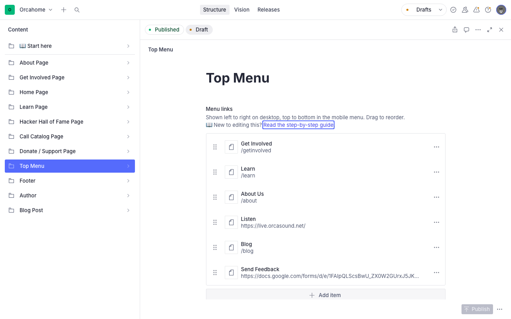
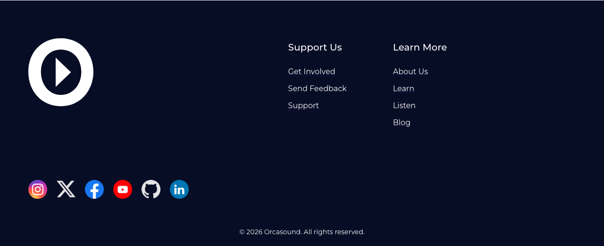
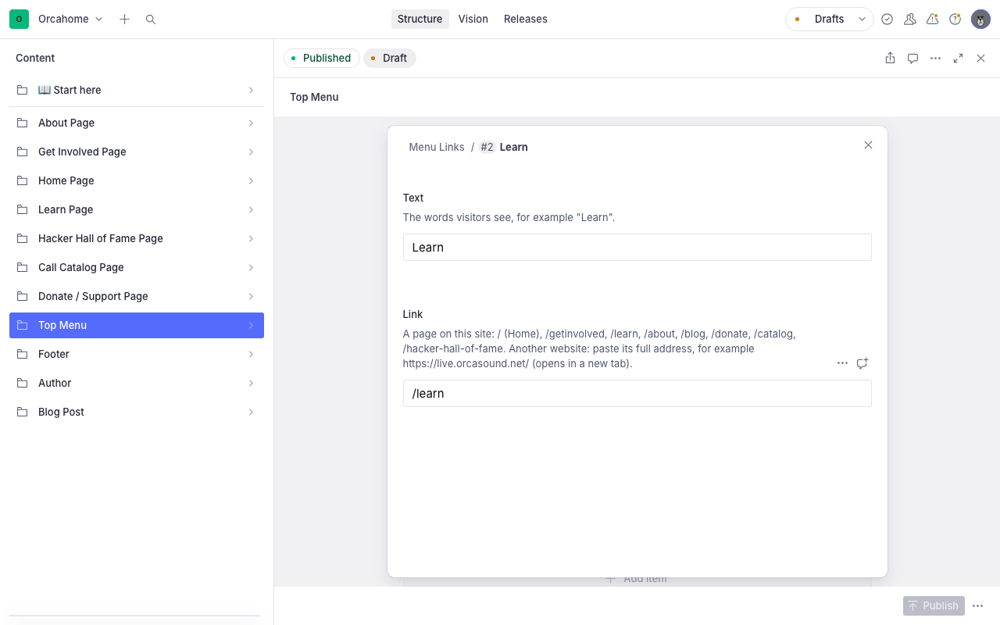
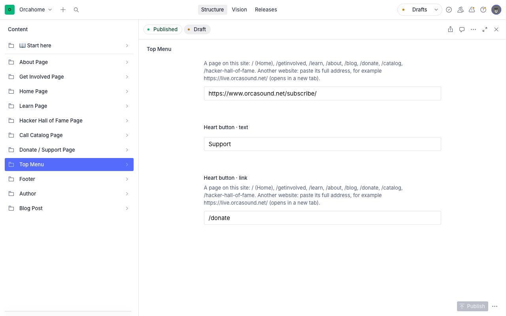
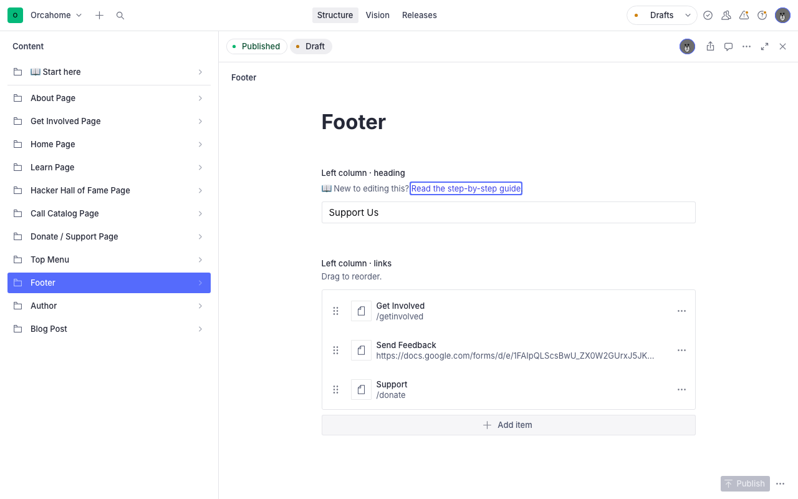
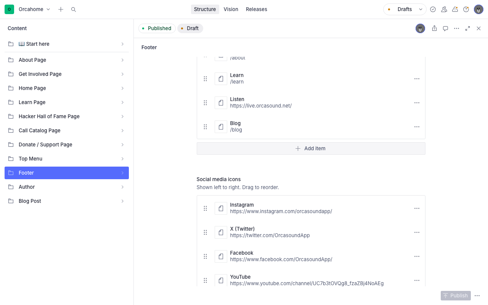

# Editing the Top Menu and Footer (Sanity CMS guide)

This guide walks you through changing the **menu at the top of every page** and
the **footer at the bottom of every page** on orcasound.tech, using Sanity
Studio. You can rename menu items, change where they go, put them in a different
order, and add or remove them — all without touching any code.

What you **can't** change here: the Orcasound logo, the icons, the colors and
layout, and the copyright line. Those stay the same.

---

## 1. Open the Studio and sign in

1. Go to **https://orcahome.sanity.studio**
2. Sign in with the Google account that was given access (ask an admin if you
   can't get in — ping @Vicky on Zulip).
3. In the left sidebar, click **Top Menu** (or **Footer**).

---

## 2. What each part controls

This is the top menu on the website:

| In the Studio                  | On the website                                             |
| ------------------------------ | ---------------------------------------------------------- |
| **Menu links**                 | Get Involved, Learn, About Us, Listen, Blog, Send Feedback |
| **Bell button · text / link**  | The round **Notify Me** button on the right                |
| **Heart button · text / link** | The round **Support** button on the right                  |

On phones, the same links appear in the ☰ menu, top to bottom.

This is the footer on the website:

| In the Studio                      | On the website                      |
| ---------------------------------- | ----------------------------------- |
| **Left column · heading / links**  | "Support Us" and the links under it |
| **Right column · heading / links** | "Learn More" and the links under it |
| **Social media icons**             | The row of icons (Instagram, X, …)  |

Phones show the same links and icons as computers.

---

## 3. Change a menu item's words or where it goes

1. Click the item in the list (for example **Learn**). A box opens.
2. **Text** is the word visitors see. Type the new wording.
3. **Link** is where the visitor goes when they click it (see the next section).
4. Close the box with the **×** in its top-right corner.

---

## 4. What to type in "Link"

There are only two kinds of link.

**A page on orcasound.tech** — type a `/` followed by the page name. Copy it
exactly from this table:

| Page                | Type this              |
| ------------------- | ---------------------- |
| Home                | `/`                    |
| Get Involved        | `/getinvolved`         |
| Learn               | `/learn`               |
| About Us            | `/about`               |
| Blog                | `/blog`                |
| Support / Donate    | `/donate`              |
| Call Catalog        | `/catalog`             |
| Hacker Hall of Fame | `/hacker-hall-of-fame` |

**Another website** — open that website in your browser, copy the whole address
from the address bar, and paste it. It must start with `https://`, for example
`https://live.orcasound.net/`. These links open in a new browser tab.

The Studio checks what you type:

- 🔴 **Red error** — the link can't work as typed (for example you forgot the
  `https://`). The Studio tells you how to fix it, and won't publish until you do.
- 🟡 **Yellow warning** — the link starts with `/` but isn't one of the pages
  above (for example `/lern`). Visitors would see a "page not found" error. Check
  your spelling against the table.

> **Adding a menu item doesn't create a page.** The menu can only point to pages
> that already exist. If you need a new page, ask a developer.

---

## 5. Add, remove, or reorder items

- **Add**: click **Add item** at the bottom of the list, then fill in **Text**
  and **Link**.
- **Remove**: click the **⋯** on the right of an item → **Remove**.
- **Reorder**: drag an item up or down by the **⋮⋮** handle on its left. The
  order in the list is the order on the website (left to right on computers, top
  to bottom on phones).

> Keep the top menu short — about 6 items with short names. Too many items or
> long names won't fit on one line on laptop screens.

---

## 6. The two round buttons (top menu)

Scroll down in **Top Menu** to find the **Bell button** (Notify Me) and the
**Heart button** (Support). Each has a **text** and a **link**, which work just
like menu items. The icons can't be changed.

---

## 7. The footer

Click **Footer** in the left sidebar. It has two columns, each with a
**heading** and a list of **links**. Edit them exactly like the top menu
(sections 3–5).

**Social media icons**: each icon has a **Platform** (pick from the list:
Instagram, X (Twitter), Facebook, YouTube, GitHub, LinkedIn) and a **Link** to
Orcasound's page on that platform. Reorder, add, and remove them like menu items.
Only these six platforms are available, because each needs its own icon.

---

## 8. Publish your changes

Nothing goes live until you **publish**.

1. Click the green **Publish** button in the bottom-right corner.
2. If you see **"Unpublished changes"**, your edits are NOT live yet — click
   **Publish**.

> ⚠️ **Don't leave edits as an unpublished draft.** The live site keeps showing
> the old menu until you publish.

## 9. When will it show on the site?

Within **about a minute** after you publish. Open any page on orcasound.tech and
refresh. If you still see the old menu, wait a minute and refresh once more.
You do **not** need a developer to deploy anything.

**Then check your work**: click every link you changed — on a computer and on a
phone — and make sure each one goes to the right place.

---

## Troubleshooting

| Problem                                              | What's going on                                                                                            |
| ---------------------------------------------------- | ---------------------------------------------------------------------------------------------------------- |
| "I edited it but the site still shows the old menu"  | You didn't **Publish**, or the ~1 minute hasn't passed. Publish, wait a minute, refresh (twice if needed). |
| "A link goes to 'page not found'"                    | The page name is misspelled, or that page doesn't exist. Compare it with the table in section 4.           |
| "I deleted all the items and the old ones came back" | On purpose: an empty list brings back the original menu, so the site is never left without one.            |
| "The menu doesn't fit on one line"                   | Shorten the names or remove an item.                                                                       |
| "I can't sign in"                                    | Ask an admin to give your Google account access to the Sanity project.                                     |

---

_Questions or something looks broken? ping @Vicky on Zulip._

---

### For developers

- Schema: `studio/schemaTypes/navigation.tsx`, `footer.tsx`, `siteLink.ts`. The
  list of known pages used by the yellow warning is `SITE_PAGES` in
  `siteLink.ts` — update it when a page is added or removed.
- Every page's `getStaticProps` returns `siteChrome` (from
  `src/sanity/siteChrome.ts`); `_app.tsx` → `Layout` → `Nav` / `Footer`. Each
  field falls back to the hard-coded defaults in `Nav.jsx` / `Footer.jsx`.
- After merging a schema change, run `cd studio && npx sanity deploy` (the hosted
  Studio doesn't auto-deploy). Vercel Preview deploys have no Sanity env vars and
  show the defaults.
